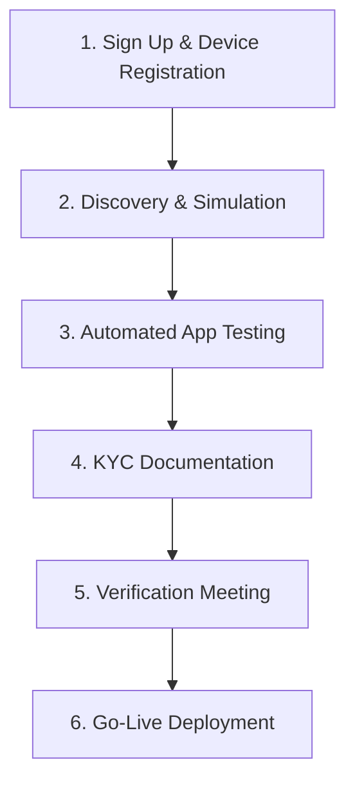

# KRA eTIMS OSCU Integration SDK


A production-ready PHP SDK for integrating with the Kenya Revenue Authority (KRA) **eTIMS OSCU** (Online Sales Control Unit) API. Built to match the official Postman collection specifications with strict header compliance, token management, and comprehensive validation.

> ⚠️ **Critical Note**: This SDK implements the **new OSCU specification** (KRA-hosted), *not* the legacy eTIMS API. OSCU requires device registration, `apigee_app_id` headers, and `cmcKey` lifecycle management.

## Author

**Bartile Emmanuel**  
📧 ebartile@gmail.com | 📱 +254757807150  
*Lead Developer, Paybill Kenya*

---

## Table of Contents

- [Introduction to eTIMS OSCU](#introduction-to-etims-oscu)
- [OSCU Integration Journey](#oscu-integration-journey)
- [Critical Requirements](#critical-requirements)
- [Features](#features)
- [Installation](#installation)
- [Configuration](#configuration)
- [Usage Guide](#usage-guide)
- [API Reference](#api-reference)
- [Field Validation Rules](#field-validation-rules)
- [Error Handling](#error-handling)
- [Troubleshooting](#troubleshooting)
- [Automated Testing Requirements](#automated-testing-requirements)
- [KYC Documentation Checklist](#kyc-documentation-checklist)
- [Go-Live Process](#go-live-process)
- [Support](#support)
- [License](#license)

---

## Introduction to eTIMS OSCU

KRA's **Electronic Tax Invoice Management System (eTIMS)** uses **OSCU** (Online Sales Control Unit) – a KRA-hosted software module that validates and signs tax invoices in real-time before issuance. Unlike legacy systems, OSCU requires:

- Pre-registered device serial numbers (`dvcSrlNo`)
- APigee-based authentication (`apigee_app_id` header)
- Communication key (`cmcKey`) lifecycle management
- Strict payload schema compliance per KRA specifications

### OSCU vs Legacy eTIMS

| Feature | OSCU (This SDK) | Legacy eTIMS |
|---------|-----------------|--------------|
| **Hosting** | KRA-hosted (cloud) | Self-hosted (on-premise) |
| **Device Registration** | Mandatory pre-registration | Not required |
| **Authentication** | Bearer token + `apigee_app_id` | Basic auth only |
| **Communication Key** | `cmcKey` required after init | Not applicable |
| **API Base URL** | `sbx.kra.go.ke/etims-oscu/api/v1` | `etims-api-sbx.kra.go.ke` |
| **Header Requirements** | Strict 6-header compliance | Minimal headers |

### Receipt Types & Labels Matrix

Each receipt is formed from a combination of receipt type and transaction type:

| RECEIPT TYPE | TRANSACTION TYPE | RECEIPT LABEL | DESCRIPTION |
|--------------|------------------|---------------|-------------|
| NORMAL       | SALES            | NS            | Standard tax invoice for customers |
| NORMAL       | CREDIT NOTE      | NC            | Refund/return invoice |
| COPY         | SALES            | CS            | Reprint with "Copy" watermark |
| COPY         | CREDIT NOTE      | CC            | Reprint of credit note |
| TRAINING     | SALES            | TS            | Training mode (no tax impact) |
| TRAINING     | CREDIT NOTE      | TC            | Training credit note |
| PROFORMA     | SALES            | PS            | Quote/proforma invoice |

### Tax Category Codes

KRA requires tax breakdown across 5 categories in all sales/purchase transactions:

| Code | Description | Standard Rate | Notes |
|------|-------------|---------------|-------|
| **A** | VAT Standard | 16% | Most goods/services |
| **B** | VAT Special | 8% / 14% | Petroleum products, etc. |
| **C** | Zero-rated | 0% | Exports, humanitarian aid |
| **D** | Exempt | 0% | Financial services, education |
| **E** | Non-taxable | 0% | Insurance, residential rent |

> 💡 **Critical**: All 15 tax fields required in payloads:  
> `taxblAmtA/B/C/D/E`, `taxRtA/B/C/D/E`, `taxAmtA/B/C/D/E`

---

## OSCU Integration Journey

KRA mandates a strict 6-phase integration process before production deployment:



### Phase 1: Sign Up & Device Registration
1. Register on [eTIMS Taxpayer Sandbox Portal](https://sbx.kra.go.ke)
2. Submit Service Request → Select "eTIMS" → Choose "OSCU" type
3. Await SMS confirmation of OSCU approval
4. **Critical**: Device serial number (`dvcSrlNo`) is provisioned during this phase

### Phase 2: Discovery & Simulation
- Create application on [GavaConnect Developer Portal](https://developer.go.ke)
- Obtain sandbox credentials:
  - Consumer Key/Secret (for token generation)
  - APigee App ID (`apigee_app_id` - required in ALL requests)
  - Approved device serial number (`dvcSrlNo`)

### Phase 3: Automated App Testing
- Run integration tests against sandbox environment
- **Critical**: Upload test artifacts within **1 hour** of test completion:
  - Item creation screenshot
  - Invoice generation screenshot
  - Sample invoice copy (PDF/print)
  - Credit note copy (PDF/print)

### Phase 4: KYC Documentation
**Third-Party Integrators Must Submit**:
- [ ] eTIMS Bio Data Form (completed)
- [ ] Certificate of Incorporation / Business Registration + CR12
- [ ] Valid Business Permit
- [ ] National IDs of directors/partners/sole proprietor
- [ ] Company Tax Compliance Certificate (valid)
- [ ] Proof of 3+ qualified technical staff (CVs + certifications)
- [ ] Notarized solvency declaration
- [ ] Technology Architecture document (TIS ↔ eTIMS integration diagram)

**Self-Integrators Only Need**:
- [ ] Items 1, 5, 6, and 8 from above list

### Phase 5: Verification Meeting
- Schedule demo via Developer Portal
- Demonstrate:
  - Invoice data database structure
  - Credit note database structure
  - Complete invoice format (with OSCU signatures)
  - Item creation workflow
  - Stock management integration
- Address KRA feedback within 48 hours if failed

### Phase 6: Go-Live Deployment
- Execute SLA with KRA (third-party integrators only)
- Receive production keys via Developer Portal
- Deploy to production environment
- Monitor compliance for first 30 days

---

## Critical Requirements

Before integration, you **MUST** complete these prerequisites:

### 1. Device Registration (MANDATORY)
- Register OSCU device via [eTIMS Taxpayer Sandbox Portal](https://sbx.kra.go.ke)
- Obtain **approved device serial number** (`dvcSrlNo`)
- ⚠️ **Dynamic/unregistered device serials fail with `resultCd: 901`** ("It is not valid device")

### 2. APigee Credentials (NON-NEGOTIABLE)
- Request `apigee_app_id` from KRA support (`timsupport@kra.go.ke`)
- Required in **ALL requests** (including initialization)
- Sandbox format: `sbx-xxxxxxxx-xxxx-xxxx-xxxx-xxxxxxxxxxxx`
- Production format: `prod-xxxxxxxx-xxxx-xxxx-xxxx-xxxxxxxxxxxx`

### 3. Communication Key Lifecycle
```php
// 1. Initialize FIRST (returns cmcKey)
$response = $client->initialize([
    'tin'      => $config['oscu']['tin'],
    'bhfId'    => $config['oscu']['bhf_id'],
    'dvcSrlNo' => 'dvcv1130', // KRA-approved serial
]);

// 2. Extract cmcKey (sandbox returns at root level)
$cmcKey = $response['cmcKey'] ?? ($response['data']['cmcKey'] ?? null);

// 3. Update config IMMEDIATELY
$config['oscu']['cmc_key'] = $cmcKey;

// 4. Recreate client with updated config (critical!)
$client = new EtimsClient($config, $auth);

// 5. ALL subsequent requests require cmcKey in headers
$client->selectCodeList([...]);
```

### 4. Invoice Numbering Rules
- **MUST be sequential integers** (1, 2, 3...) – **NOT strings** (`INV001`)
- Must be unique per branch office (`bhfId`)
- Cannot be reused even after cancellation
- KRA rejects non-integer invoice numbers with `resultCd: 500`

### 5. Date Format Specifications
| Field | Format | Example | Validation Rule |
|-------|--------|---------|-----------------|
| `salesDt`, `pchsDt`, `ocrnDt` | `YYYYMMDD` | `20260131` | Cannot be future date |
| `cfmDt`, `stockRlsDt`, `rcptPbctDt` | `YYYYMMDDHHmmss` | `20260131143022` | Must be current/past |
| `lastReqDt` | `YYYYMMDDHHmmss` | `20260130143022` | Cannot be future date; max 7 days old |

---

## Features

✅ **Postman Collection Compliance**  
- 100% header, path, and payload alignment with official KRA Postman collection  
- Correct nested paths (`/insert/stockIO`, `/save/stockMaster`)  
- All 8 functional categories implemented  

✅ **Strict Header Management**  
| Endpoint Type | Required Headers | Initialization Exception |
|---------------|------------------|--------------------------|
| **Initialization** | `Authorization`, `apigee_app_id` | ❌ NO `tin`/`bhfId`/`cmcKey` |
| **All Other Endpoints** | `Authorization`, `apigee_app_id`, `tin`, `bhfId`, `cmcKey` | ✅ Full header set |

✅ **Token Lifecycle Management**  
- Automatic token caching with 60-second buffer  
- Transparent token refresh on 401 errors  
- File-based cache with configurable location  

✅ **Comprehensive Validation**  
- Respect\Validation schemas matching KRA specifications  
- Field-level validation with human-readable errors  
- Date format enforcement (`YYYYMMDDHHmmss`)  
- Tax category validation (A/B/C/D/E)  

✅ **Production Ready**  
- SSL verification enabled by default  
- Timeout configuration (default: 30s)  
- Environment-aware (sandbox/production)  
- Detailed error diagnostics with KRA fault strings  

---

## Installation

```bash
composer require paybilldev/kra-etims-sdk
```

### Requirements
- PHP 8.1+
- cURL extension (with SSL support)
- JSON extension
- Respect\Validation (`composer require respect/validation`)

---

## Configuration

### Option 1: PHP Config Array

```php
<?php
return [
    'env' => 'sbx', // 'sbx' for sandbox, 'prod' for production

    'cache_file' => sys_get_temp_dir() . '/kra_etims_token.json',

    'auth' => [
        'sbx' => [
            'token_url'      => 'https://sbx.kra.go.ke/v1/token/generate',
            'consumer_key'   => getenv('KRA_CONSUMER_KEY'),
            'consumer_secret'=> getenv('KRA_CONSUMER_SECRET'),
        ],
        'prod' => [
            'token_url'      => 'https://kra.go.ke/v1/token/generate',
            'consumer_key'   => getenv('KRA_PROD_CONSUMER_KEY'),
            'consumer_secret'=> getenv('KRA_PROD_CONSUMER_SECRET'),
        ],
    ],

    'api' => [
        'sbx' => [
            'base_url'      => 'https://sbx.kra.go.ke/etims-oscu/api/v1',
            'apigee_app_id' => getenv('KRA_APIGEE_APP_ID'), // 🔑 CRITICAL
        ],
        'prod' => [
            'base_url'      => 'https://api.developer.go.ke/etims-oscu/api/v1', // Production URL
            'apigee_app_id' => getenv('KRA_PROD_APIGEE_APP_ID'),
        ],
    ],

    'http' => [
        'timeout' => 30,
    ],

    'oscu' => [
        'tin'     => getenv('KRA_TIN'),
        'bhf_id'  => getenv('KRA_BHF_ID'),
        'cmc_key' => '', // Set AFTER initialization
    ],

    // EXACT ENDPOINT PATHS FROM POSTMAN COLLECTION
    'endpoints' => [
        // INITIALIZATION (ONLY endpoint without tin/bhfId/cmcKey headers)
        'initialize' => '/initialize',

        // DATA MANAGEMENT
        'selectCodeList'     => '/selectCodeList',
        'selectItemClass'    => '/selectItemClass',
        'branchList'         => '/branchList',
        'selectTaxpayerInfo' => '/selectTaxpayerInfo',
        'selectCustomerList' => '/selectCustomerList',
        'selectNoticeList'   => '/selectNoticeList',
        'customerPinInfo'    => '/customerPinInfo',

        // BRANCH MANAGEMENT
        'branchInsuranceInfo'    => '/branchInsuranceInfo',
        'branchUserAccount'      => '/branchUserAccount',
        'branchSendCustomerInfo' => '/branchSendCustomerInfo',

        // ITEM MANAGEMENT
        'saveItem'            => '/saveItem',
        'itemInfo'            => '/itemInfo',
        'saveItemComposition' => '/saveItemComposition',

        // IMPORTS MANAGEMENT
        'importedItemInfo'          => '/importedItemInfo',
        'importedItemConvertedInfo' => '/importedItemConvertedInfo',

        // PURCHASE MANAGEMENT
        'getPurchaseTransactionInfo'  => '/getPurchaseTransactionInfo',
        'sendPurchaseTransactionInfo' => '/sendPurchaseTransactionInfo',

        // SALES MANAGEMENT
        'sendSalesTransaction'   => '/sendSalesTransaction',
        'selectSalesTransactions'=> '/selectSalesTransactions',
        'selectInvoiceDetail'    => '/selectInvoiceDetail',

        // STOCK MANAGEMENT (NESTED PATHS)
        'insertStockIO'        => '/insert/stockIO',    // Critical: slash in path
        'saveStockMaster'      => '/save/stockMaster',  // Critical: slash in path
        'selectStockMoveLists' => '/selectStockMoveLists',
    ],
];
```

> 💡 **Production URL Note**:  
> Production base URL is `https://api.developer.go.ke/etims-oscu/api/v1` (NOT `kra.go.ke`)

---

## Usage Guide

### Step 1: Initialize SDK

```php
<?php
require_once __DIR__ . '/vendor/autoload.php';

use KraEtimsSdk\Services\AuthClient;
use KraEtimsSdk\Services\EtimsClient;

// Load config
$config = require __DIR__ . '/config.php';

// Bootstrap clients
$auth = new AuthClient($config);
$client = new EtimsClient($config, $auth);
```

### Step 2: Authenticate (Get Access Token)

```php
try {
    // Force fresh token (optional - cache used by default)
    $token = $auth->token(true);
    echo "✅ Token acquired: " . substr($token, 0, 20) . "...\n";
} catch (\Throwable $e) {
    echo "❌ Authentication failed: " . $e->getMessage() . "\n";
    exit(1);
}
```

### Step 3: OSCU Initialization (Critical Step)

```php
try {
    // ⚠️ MUST use KRA-approved device serial (NOT dynamic!)
    // Common sandbox test value (if pre-provisioned by KRA):
    $deviceSerial = 'dvcv1130'; 
    
    $response = $client->initialize([
        'tin'      => $config['oscu']['tin'],
        'bhfId'    => $config['oscu']['bhf_id'],
        'dvcSrlNo' => $deviceSerial, // REPLACE with your approved serial
    ]);

    // Extract cmcKey (sandbox returns at root level)
    $cmcKey = $response['cmcKey'] ?? ($response['data']['cmcKey'] ?? null);
    
    if (!$cmcKey) {
        throw new \RuntimeException('cmcKey not found in response');
    }

    // Update config IMMEDIATELY
    $config['oscu']['cmc_key'] = $cmcKey;
    
    // Recreate client with updated config (critical!)
    $client = new EtimsClient($config, $auth);
    
    echo "✅ OSCU initialized. cmcKey: " . substr($cmcKey, 0, 15) . "...\n";
} catch (\KraEtimsSdk\Exceptions\ApiException $e) {
    if ($e->getErrorCode() === '901') {
        echo "❌ DEVICE NOT VALID (resultCd 901)\n";
        echo "   → Device serial not registered with KRA\n";
        echo "   → Contact timsupport@kra.go.ke for approved serial\n";
        echo "   → Common sandbox test value: 'dvcv1130' (may work if pre-provisioned)\n";
    }
    exit(1);
}
```

### Step 4: Business Operations (Postman-Compliant Payload)

```php
// Fetch code list (demonstrates header injection)
try {
    $codes = $client->selectCodeList([
        'tin'       => $config['oscu']['tin'],
        'bhfId'     => $config['oscu']['bhf_id'],
        'lastReqDt' => date('YmdHis', strtotime('-7 days')), // NOT future date
    ]);
    echo "✅ Retrieved " . count($codes['itemList'] ?? []) . " codes\n";
} catch (\Throwable $e) {
    echo "❌ Code list fetch failed: " . $e->getMessage() . "\n";
}

// Send sales transaction (FULL Postman payload structure)
try {
    $response = $client->sendSalesTransaction([
        'invcNo'        => 1, // INTEGER (sequential) - NOT string!
        'orgInvcNo'     => 0, // 0 for new invoices
        'custTin'       => 'A123456789Z',
        'custNm'        => 'Test Customer',
        'salesTyCd'     => 'N', // N=Normal, R=Return
        'rcptTyCd'      => 'R', // R=Receipt
        'pmtTyCd'       => '01', // 01=Cash
        'salesSttsCd'   => '01', // 01=Completed
        'cfmDt'         => date('YmdHis'), // YYYYMMDDHHmmss
        'salesDt'       => date('Ymd'),    // YYYYMMDD (NO time)
        'stockRlsDt'    => date('YmdHis'),
        'cnclReqDt'     => null, // Nullable
        'cnclDt'        => null,
        'rfdDt'         => null,
        'rfdRsnCd'      => null,
        'totItemCnt'    => 1,
        // TAX BREAKDOWN (ALL 15 FIELDS REQUIRED)
        'taxblAmtA'     => 0.00,
        'taxblAmtB'     => 0.00,
        'taxblAmtC'     => 81000.00,
        'taxblAmtD'     => 0.00,
        'taxblAmtE'     => 0.00,
        'taxRtA'        => 0.00,
        'taxRtB'        => 0.00,
        'taxRtC'        => 0.00,
        'taxRtD'        => 0.00,
        'taxRtE'        => 0.00,
        'taxAmtA'       => 0.00,
        'taxAmtB'       => 0.00,
        'taxAmtC'       => 0.00,
        'taxAmtD'       => 0.00,
        'taxAmtE'       => 0.00,
        'totTaxblAmt'   => 81000.00,
        'totTaxAmt'     => 0.00,
        'totAmt'        => 81000.00,
        'prchrAcptcYn'  => 'N', // Purchaser acceptance: Y/N
        'remark'        => 'Test transaction',
        'regrId'        => 'Admin',
        'regrNm'        => 'Admin',
        'modrId'        => 'Admin',
        'modrNm'        => 'Admin',
        // RECEIPT OBJECT (REQUIRED)
        'receipt' => [
            'custTin'       => 'A123456789Z',
            'custMblNo'     => null,
            'rptNo'         => 1,
            'rcptPbctDt'    => date('YmdHis'),
            'trdeNm'        => 'Shopwithus',
            'adrs'          => 'Westlands, Nairobi',
            'topMsg'        => 'Thank you for your business',
            'btmMsg'        => 'Welcome again',
            'prchrAcptcYn'  => 'N',
        ],
        // ITEM LIST (EXACT Postman structure)
        'itemList' => [
            [
                'itemSeq'    => 1,
                'itemCd'     => 'KE2NTBA00000001', // Must exist in KRA system
                'itemClsCd'  => '1000000000',
                'itemNm'     => 'Brand A',
                'barCd'      => '', // Nullable but REQUIRED field
                'pkgUnitCd'  => 'NT',
                'pkg'        => 1,  // Package quantity
                'qtyUnitCd'  => 'BA',
                'qty'        => 90.0,
                'prc'        => 1000.00,
                'splyAmt'    => 81000.00,
                'dcRt'       => 10.0,  // Discount rate %
                'dcAmt'      => 9000.00, // Discount amount
                'isrccCd'    => null,  // Insurance code (nullable)
                'isrccNm'    => null,
                'isrcRt'     => null,
                'isrcAmt'    => null,
                'taxTyCd'    => 'C',   // C = Zero-rated/Exempt
                'taxblAmt'   => 81000.00,
                'taxAmt'     => 0.00,
                'totAmt'     => 81000.00, // splyAmt - dcAmt + taxAmt
            ],
        ],
    ]);
    
    echo "✅ Sales transaction sent (resultCd: {$response['resultCd']})\n";
    echo "Receipt Signature: {$response['data']['rcptSign']}\n";
} catch (\Throwable $e) {
    echo "❌ Sales transaction failed: " . $e->getMessage() . "\n";
}
```

---

## API Reference

### Functional Categories (8 Total)

| Category | Purpose | Endpoints |
|----------|---------|-----------|
| **Initialization** | Device registration & cmcKey acquisition | `initialize` |
| **Data Management** | Retrieve standard codes & master data | `selectCodeList`, `selectItemClass`, `branchList`, `selectTaxpayerInfo`, `selectCustomerList`, `selectNoticeList`, `customerPinInfo` |
| **Branch Management** | Manage branch offices & users | `branchInsuranceInfo`, `branchUserAccount`, `branchSendCustomerInfo` |
| **Item Management** | Item master data & composition | `saveItem`, `itemInfo`, `saveItemComposition` |
| **Imports Management** | Customs-imported items | `importedItemInfo`, `importedItemConvertedInfo` |
| **Purchase Management** | Purchase transactions | `getPurchaseTransactionInfo`, `sendPurchaseTransactionInfo` |
| **Sales Management** | Sales transactions & invoices | `sendSalesTransaction`, `selectSalesTransactions`, `selectInvoiceDetail` |
| **Stock Management** | Inventory movements & stock levels | `insertStockIO`, `saveStockMaster`, `selectStockMoveLists` |

### Core Classes

| Class | Purpose |
|-------|---------|
| `AuthClient` | Token generation, caching (60s buffer), and refresh management |
| `BaseClient` | HTTP request handling, header management, error unwrapping |
| `EtimsClient` | Business endpoint methods (all 8 functional categories) |
| `Validator` | Payload validation against KRA schemas (Respect\Validation) |

---

## Field Validation Rules (From Postman Collection)

| Field | Validation Rule | Error if Violated |
|-------|-----------------|-------------------|
| `dvcSrlNo` | Must be pre-registered with KRA | `resultCd: 901` "It is not valid device" |
| `lastReqDt` | Cannot be future date; max 7 days old | `resultCd: 500` "Check request body" |
| `salesDt` | Must be `YYYYMMDD` format; not future | `resultCd: 500` |
| `cfmDt` | Must be `YYYYMMDDHHmmss` format | `resultCd: 500` |
| `invcNo` | Must be sequential integer (not string) | `resultCd: 500` |
| `taxTyCd` | Must be A/B/C/D/E | `resultCd: 500` |
| `itemCd` | Must exist in KRA system (for transactions) | `resultCd: 500` |
| `pkg` | Must be ≥ 1 | `resultCd: 500` |
| `qty` | Must be > 0.001 | `resultCd: 500` |
| `dcRt` | Cannot be negative | `resultCd: 500` |
| `dclDe` (imports) | Must be `DDMMYYYY` format | `resultCd: 500` |

---

## Error Handling

### Exception Types

| Exception | When Thrown | Example |
|-----------|-------------|---------|
| `AuthenticationException` | Token generation fails | Invalid consumer key/secret |
| `ApiException` | KRA business error (`resultCd !== '0000'`) | `resultCd: 500` (invalid payload) |
| `ValidationException` | Payload fails schema validation | Missing required field |

### Handling Pattern

```php
try {
    $response = $client->sendSalesTransaction($payload);
} catch (\KraEtimsSdk\Exceptions\ValidationException $e) {
    echo "Validation failed:\n";
    foreach ($e->getErrors() as $error) {
        echo "  • $error\n";
    }
} catch (\KraEtimsSdk\Exceptions\ApiException $e) {
    echo "KRA API Error ({$e->getErrorCode()}): {$e->getMessage()}\n";
    
    // Get full KRA response for debugging
    $details = $e->getDetails();
    if ($details && isset($details['resultMsg'])) {
        echo "KRA Message: {$details['resultMsg']}\n";
    }
} catch (\KraEtimsSdk\Exceptions\AuthenticationException $e) {
    echo "Authentication failed: {$e->getMessage()}\n";
    
    // Attempt token refresh
    try {
        $auth->token(true); // Force refresh
        // Retry operation...
    } catch (\Throwable $ex) {
        echo "Token refresh failed: {$ex->getMessage()}\n";
    }
}
```

### Comprehensive KRA Error Codes

| Code | Meaning | Solution |
|------|---------|----------|
| `0000` | Success | ✅ Operation completed |
| `901` | "It is not valid device" | Use KRA-approved device serial |
| `902` | "Invalid cmcKey" | Re-initialize OSCU to get fresh cmcKey |
| `500` | "Check request body" | Validate payload against Postman schema |
| `501` | "Mandatory information missing" | Check required fields per endpoint |
| `502` | "Invalid format" | Fix date formats / data types |
| `503` | "Data not found" | Verify TIN/branch/item exists in KRA system |
| `504` | "Duplicate data" | Use unique invoice number |
| `505` | "Data relationship error" | Check parent-child relationships (e.g., item composition) |
| `401` | "Unauthorized" | Check token validity + apigee_app_id header |
| `403` | "Forbidden" | Verify APigee app permissions |
| `429` | "Rate limit exceeded" | Implement request throttling (max 100 req/min) |

---

## Troubleshooting

### ❌ "It is not valid device" (resultCd: 901)

**Cause**: Device serial not registered with KRA sandbox  
**Solution**:
1. Email `timsupport@kra.go.ke` with subject:  
   `"Request for OSCU Sandbox Test Credentials - [Your Company Name] - PIN: [Your PIN]"`
2. Use **static** approved serial (e.g., `dvcv1130`) – never generate dynamically
3. Verify TIN/branch ID match registered device

### ❌ "Invalid cmcKey" (resultCd: 902)

**Cause**: cmcKey expired or not set in config  
**Solution**:
```php
// After initialization:
$config['oscu']['cmc_key'] = $response['cmcKey'];
$client = new EtimsClient($config, $auth); // MUST recreate client
```

### ❌ Missing apigee_app_id header

**Cause**: `apigee_app_id` not set in config  
**Solution**:
```php
'api' => [
    'sbx' => [
        'apigee_app_id' => 'sbx-xxxxxxxx-xxxx-xxxx-xxxx-xxxxxxxxxxxx', // 🔑 REQUIRED
    ],
],
```

### ❌ Trailing spaces in URLs

**Cause**: Copy-paste errors from documentation  
**Solution**: Always use `trim()` on URLs:
```php
'token_url' => trim('https://sbx.kra.go.ke/v1/token/generate'),
```

### ❌ Invoice number rejected

**Cause**: Using string prefix (`INV001`) instead of integer  
**Solution**: Use sequential integers starting from 1:
```php
'invcNo' => 1, // ✅ Correct
// NOT 'INV001' ❌
```

---

## Automated Testing Requirements

KRA mandates successful completion of automated tests before verification:

### Test Execution Flow
1. Run integration tests against sandbox environment
2. System validates:
   - Token generation
   - OSCU initialization
   - Code list retrieval
   - Item creation
   - Sales transaction with full tax breakdown
   - Invoice retrieval
3. Upon success, system provides **1-hour window** to upload artifacts

### Required Artifacts (Upload Within 1 Hour)
| Artifact | Format | Requirements |
|----------|--------|--------------|
| Item Creation Screenshot | PNG/JPEG | Must show item code, tax category, price |
| Invoice Generation Screenshot | PNG/JPEG | Must show OSCU signatures, QR code |
| Invoice Copy | PDF | Full invoice with all KRA-mandated fields |
| Credit Note Copy | PDF | Must show original invoice reference |

> ⚠️ **Failure to upload within 1 hour** = Test invalidated → Must re-run entire test suite

---

## KYC Documentation Checklist

### Third-Party Integrators (All Required)
- [ ] eTIMS Bio Data Form (completed with director details)
- [ ] Certificate of Incorporation + CR12 (or Business Registration Certificate)
- [ ] Valid Business Permit (current year)
- [ ] National IDs of all directors/partners
- [ ] Company Tax Compliance Certificate (valid for current year)
- [ ] Proof of 3+ qualified technical staff:
  - CVs showing PHP/Java/C# experience
  - Certifications (e.g., AWS, Azure, KRA eTIMS training)
  - Employment contracts showing system administration duties
- [ ] Notarized solvency declaration (signed by director + notary public)
- [ ] Technology Architecture document:
  - System diagram showing TIS ↔ OSCU data flow
  - Database schema for invoice storage
  - Security measures (encryption, access controls)
  - Disaster recovery plan

### Self-Integrators (Minimal Set)
- [ ] eTIMS Bio Data Form
- [ ] Company Tax Compliance Certificate
- [ ] National ID of sole proprietor/director
- [ ] Technology Architecture document (simplified)

---

## Go-Live Process

### For Third-Party Integrators
1. Upon KYC approval, receive SLA template via Developer Portal
2. Complete SLA with company details and authorized signatory
3. Email signed SLA to `timsupport@kra.go.ke` with subject:  
   `"SLA Execution with KRA - [Your Company Name]"`
4. Await KRA approval (5-7 business days)
5. Receive production keys via Developer Portal:
   - Production `apigee_app_id`
   - Production consumer key/secret
6. Deploy to production environment (`api.developer.go.ke`)
7. Monitor compliance for first 30 days (KRA conducts spot checks)

### For Self-Integrators
1. Receive interim approval letter after KYC verification
2. Receive production keys via Developer Portal
3. Deploy directly to production environment
4. No SLA execution required

> 💡 **Production URL**: `https://api.developer.go.ke/etims-oscu/api/v1`  
> ⚠️ **Never use sandbox credentials in production** – KRA monitors environment separation strictly

---

## Support

### KRA Official Support Channels
| Purpose | Contact | Expected Response |
|---------|---------|-------------------|
| Sandbox credentials & device registration | `timsupport@kra.go.ke` | 1-3 business days |
| API technical issues & Postman collection | `apisupport@kra.go.ke` | 24-48 hours |
| Developer Portal access issues | `apisupport@kra.go.ke` | 24 hours |
| Verification meeting scheduling | Developer Portal UI | Instant (self-service) |
| SLA execution queries | `timsupport@kra.go.ke` | 3-5 business days |

### SDK Support
- **GitHub Issues**: [github.com/paybilldev/kra-etims-sdk/issues](https://github.com/paybilldev/kra-etims-sdk/issues)
- **Email**: ebartile@gmail.com (for integration guidance)
- **Emergency Hotline**: +254757807150 (business hours only)

> ℹ️ **Disclaimer**: This SDK is not officially endorsed by Kenya Revenue Authority. Always verify integration requirements with KRA before production deployment. KRA may update API specifications without notice – monitor [GavaConnect Portal](https://developer.go.ke) for updates.

---

## License

MIT License

Copyright © 2024-2026 Bartile Emmanuel / Paybill Kenya

Permission is hereby granted, free of charge, to any person obtaining a copy of this software and associated documentation files (the "Software"), to deal in the Software without restriction, including without limitation the rights to use, copy, modify, merge, publish, distribute, sublicense, and/or sell copies of the Software, and to permit persons to whom the Software is furnished to do so, subject to the following conditions:

The above copyright notice and this permission notice shall be included in all copies or substantial portions of the Software.

THE SOFTWARE IS PROVIDED "AS IS", WITHOUT WARRANTY OF ANY KIND, EXPRESS OR IMPLIED, INCLUDING BUT NOT LIMITED TO THE WARRANTIES OF MERCHANTABILITY, FITNESS FOR A PARTICULAR PURPOSE AND NONINFRINGEMENT. IN NO EVENT SHALL THE AUTHORS OR COPYRIGHT HOLDERS BE LIABLE FOR ANY CLAIM, DAMAGES OR OTHER LIABILITY, WHETHER IN AN ACTION OF CONTRACT, TORT OR OTHERWISE, ARISING FROM, OUT OF OR IN CONNECTION WITH THE SOFTWARE OR THE USE OR OTHER DEALINGS IN THE SOFTWARE.

---

## Attribution

This SDK was developed by **Bartile Emmanuel** for Paybill Kenya to simplify KRA eTIMS OSCU integration for Kenyan businesses. Special thanks to KRA for providing comprehensive API documentation and Postman collections.

> 🇰🇪 **Proudly Made in Kenya** – Supporting digital tax compliance for East Africa's largest economy.
